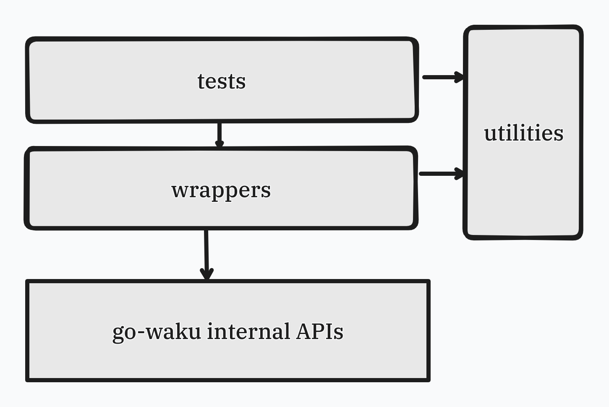

# Waku-Go-Bindings-Tests

This test framework verifies the functionality of Waku nodes—**creation**, **relay**, and **topic subscription**—using Go wrappers.

---

## Test Framework Design



---

## Steps to Use the Test Framework

1. **Clone the Repository:**
   ```bash
   git clone https://github.com/waku-org/waku-go-bindings-tests
   ```

2. **Clone the Submodule:**
   ```bash
   git clone --recurse-submodules https://github.com/waku-org/nwaku
   ```

3. **Modify Package Name:**
   - Navigate to `src/nwaku/example/golang`
   - Open `waku.go` and change the package name from `main` to `golang`  
     > **Note:** This step is **mandatory**
   - Follow the remaining steps in the README file located in that directory

4. **Build the Shared Library:**
   - After running the commands in the README, the file `libwaku.so` will appear in `nwaku/build`

5. **Run the Test Suite:**
   - From the repository's root folder, execute the following commands:
     ```bash
     go build src/libs/waku_wrappers.go
     go test -v ./tests/...
     ```

6. **View Test Results:**
   - The tests will run, and the output will look like this:
     
     

---

## Notes
- Ensure Go is properly installed and configured.

---


